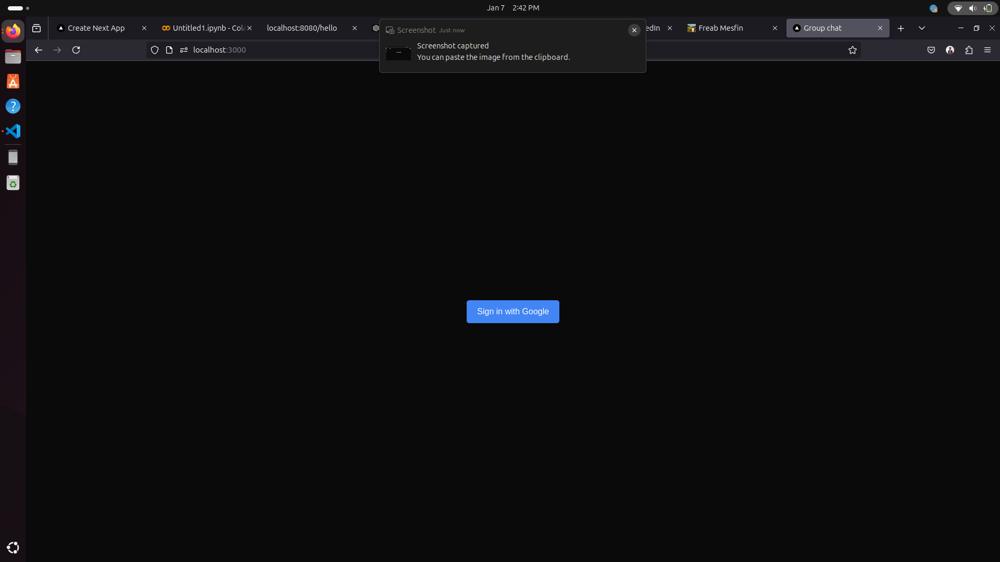
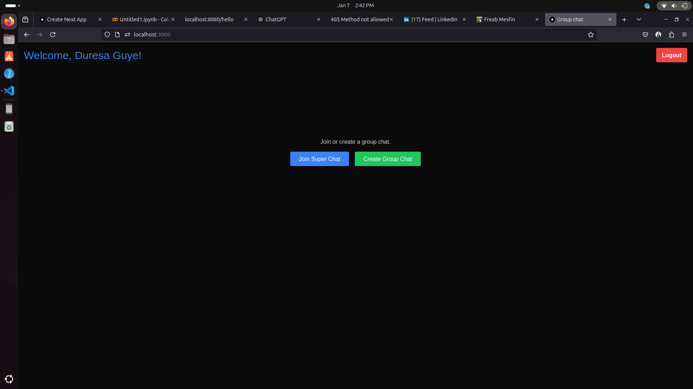

# Simple Chat App

## Screenshots

Here are some screenshots of the Simple Chat App:

### Login Screen

### Home screen

### Chat screen

A simple real-time chat application built with **Next.js** and **Firebase**. This application allows users to communicate seamlessly, leveraging Firebase for authentication and data storage.

## Features

- - **User Authentication**: Sign up and log in using Google Login with Firebase Authentication.

- **Responsive Design**: Works well on both desktop and mobile devices.

- **Message History**: Users can view the chat history.

- - **Easy to Use**: Simple and intuitive user interface.

- *- **Group Chat**: Create new group chats to communicate with multiple users.

- **- **Supergroup Links**: Generate links to share and join groups easily.

- *
- **Join Existing Supergroups**: Users can join already created supergroups using shared links.*Group Chat**: Create new group chats to communicate with multiple users.
- **Supergroup Links**: Generate links to share and join groups easily.

## Technologies Used

- [Next.js](https://nextjs.org/) - A React framework for building server-side rendered applications.
- [Firebase](https://firebase.google.com/) - A platform for building web and mobile applications, providing a real-time database and authentication.
- [React](https://reactjs.org/) - A JavaScript library for building user interfaces.
- [CSS Modules](https://github.com/css-modules/css-modules) - For styling components.
- [Tailwind CSS](https://tailwindcss.com/) - A utility-first CSS framework for rapidly building custom designs.

